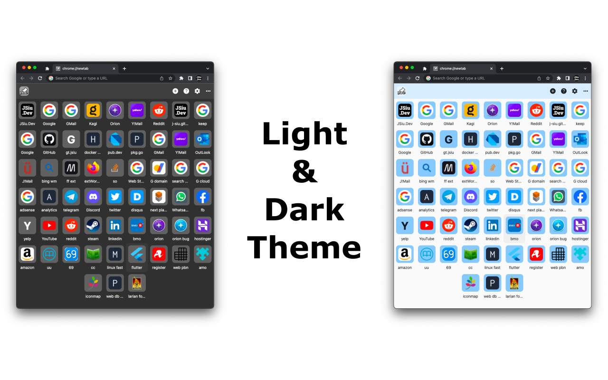
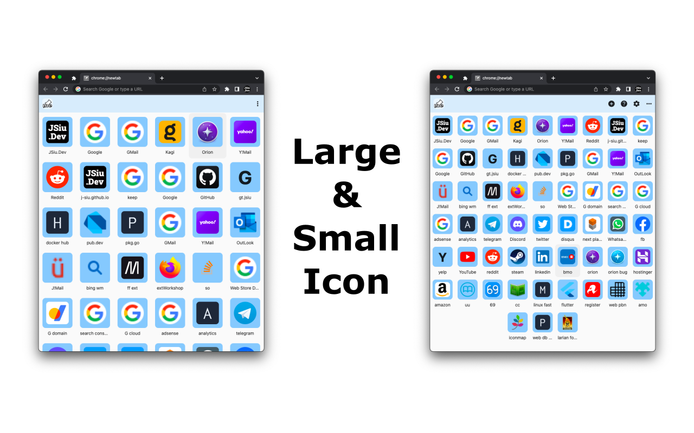

# 

Pin website to New Tab page from any device, any browser! Support Import/Export without sign-in.
### Table Of Content
<!-- TOC -->

- [Table Of Content](#table-of-content)
- [Highlight](#highlight)
- [Platform](#platform)
- [Usage](#usage)
  - [Google Login Optional](#google-login-optional)
  - [Import/Export](#importexport)
    - [Support](#support)
    - [Access](#access)
    - [Import](#import)
  - [Preset Sites](#preset-sites)
    - [Remove One by One](#remove-one-by-one)
    - [Remove All](#remove-all)
- [Planned](#planned)
- [Issue](#issue)
- [Build](#build)
- [Repository](#repository)
- [Contributors](#contributors)
- [Change Log](#change-log)
- [Library](#library)
- [License](#license)

<!-- /TOC -->

<!--more-->

### Highlight

 

- Dart/Light Theme
- Drag & Drop to rearrange pinned sites
- Import/Export
- Large Icon
- Sites are saved locally in your browser
- Unlimited sites

### Platform

Platform|URL
---|---
Web|https://pin2me.dev/
Demo|https://j-siu.github.io/app/pin2me.dev/
Chrome Extension|https://chrome.google.com/webstore/detail/pin2me/hclokpdkmfceobbckckjkdohdgeljlld
Firefox Extension|https://addons.mozilla.org/en-US/firefox/addon/pin2me/

### Usage

#### Google Login (Optional)

Google Login(optional) enable following

- Saved pinned sites in your Google Drive [AppData] folder
- Synced between browsers
- Access pinned sites from https://pin2me.dev/
  - For browsers/devices don't support add-on/extension

#### Import/Export
##### Support
- Apply setting from editor box
- Copy to clipboard
- Save to file (Pin2Me.json)
- Import
  - Save pinned sites to your browser, and sync to your Google Drive 'AppData' folder if signed-in.
  - No upload to other server. This is the same when using https://pin2me.dev/ .

##### Access
1. Click 3-dot icon on upper right to expand menu items
2. Click setting icon
3. Click 'Advance' in pop-up dialog
4. Click 'Import/Export' button

##### Import
1. Open Pin2Me.json with text editor
2. Copy and paste content into Import/Export editor box
3. Click 'Apply'.

#### Preset Sites

Pin2Me comes with a few preset sites. Their URLs and names cannot be change, but can moved and removed. To remove them:
##### Remove One by One
- Double click to open site setting
- Click 'Delete'
##### Remove All
1. Click 3-dot icon on upper right to expand menu items
2. Click setting icon
3. Click 'Advance' in pop-up dialog
4. Click 'Remove Default Sites'

### Planned
- Drag & Drop for import
- More platforms
- Extension support web page context menu

### Issue
- Firefox
  - #2 Extension showing a extension url in address bar
  - Add-on not activating on first tab

### Build

- [BUILD.md](BUILD.md)

### Repository

- [pin2me](https://github.com/J-Siu/pin2m2/)

### Contributors

- [John, Sing Dao, Siu](https://github.com/J-Siu)

### Change Log

- [CHANGELOG.md](CHANGELOG.md)
### Library

Library|Source|Pub.Dev
---|---|---
json_preferences|https://github.com/J-Siu/flutter_lazy|https://pub.dev/packages/json_preferences
lazy_cache|https://github.com/J-Siu/flutter_lazy|https://pub.dev/packages/lazy_cache
lazy_collection|https://github.com/J-Siu/flutter_lazy|https://pub.dev/packages/lazy_collection
lazy_g_drive|https://github.com/J-Siu/flutter_lazy|https://pub.dev/packages/lazy_g_srive
lazy_g_sync|https://github.com/J-Siu/flutter_lazy|https://pub.dev/packages/lazy_g_sync
lazy_log|https://github.com/J-Siu/flutter_lazy|https://pub.dev/packages/lazy_log
lazy_sign_in|https://github.com/J-Siu/flutter_lazy|https://pub.dev/packages/lazy_sign_in
lazy_sign_in_extension|https://github.com/J-Siu/flutter_lazy|https://pub.dev/packages/lazy_sign_in_extension
lazy_sign_in_google|https://github.com/J-Siu/flutter_lazy|https://pub.dev/packages/lazy_sign_in_google
provider|https://github.com/rrousselGit/provider|https://pub.dev/packages/provider
reorderables|https://github.com/hanshengchiu/reorderables|https://pub.dev/packages/reorderables
theme_provider|https://www.github.com/kdsuneraavinash/theme_provider|https://pub.dev/packages/theme_provider

### License

The MIT License (MIT)

Copyright © 2022 John, Sing Dao, Siu <john.sd.siu@gmail.com>

Permission is hereby granted, free of charge, to any person obtaining a copy of this software and associated documentation files (the "Software"), to deal in the Software without restriction, including without limitation the rights to use, copy, modify, merge, publish, distribute, sublicense, and/or sell copies of the Software, and to permit persons to whom the Software is furnished to do so, subject to the following conditions:

The above copyright notice and this permission notice shall be included in all copies or substantial portions of the Software.

THE SOFTWARE IS PROVIDED "AS IS", WITHOUT WARRANTY OF ANY KIND, EXPRESS OR IMPLIED, INCLUDING BUT NOT LIMITED TO THE WARRANTIES OF MERCHANTABILITY, FITNESS FOR A PARTICULAR PURPOSE AND NONINFRINGEMENT. IN NO EVENT SHALL THE AUTHORS OR COPYRIGHT HOLDERS BE LIABLE FOR ANY CLAIM, DAMAGES OR OTHER LIABILITY, WHETHER IN AN ACTION OF CONTRACT, TORT OR OTHERWISE, ARISING FROM, OUT OF OR IN CONNECTION WITH THE SOFTWARE OR THE USE OR OTHER DEALINGS IN THE SOFTWARE.
